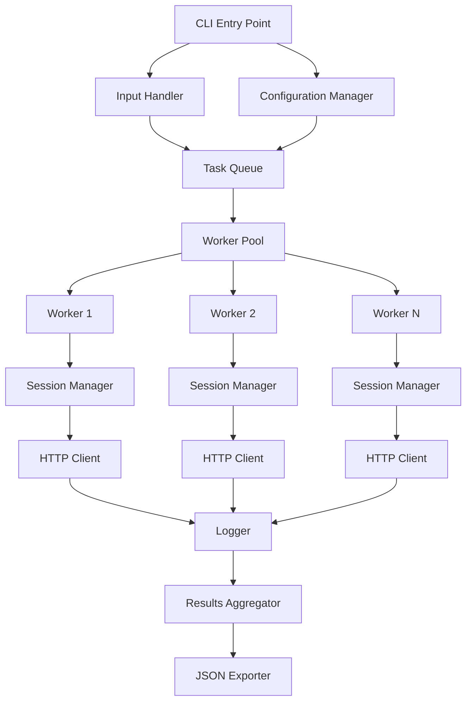

# Design Document: OpenAI Auth Tester

## Overview

The OpenAI Auth Tester is a Node.js automation tool that simulates phone number registration flows against OpenAI's authentication API. The system uses a modular architecture with isolated session management, anti-bot protection handling, and comprehensive logging capabilities. The design emphasizes concurrent execution with proper resource isolation, configurable retry logic, and structured result export.

## Architecture

### High-Level Architecture



### Component Interaction Flow

1. CLI loads configuration and phone numbers
2. Task queue distributes phone numbers to worker pool
3. Each worker creates an isolated session with its own cookie jar
4. Workers make HTTP requests with anti-bot protection handling
5. All requests/responses are logged
6. Results are aggregated and exported to JSON

## Components and Interfaces

### 1. Configuration Manager

**Responsibility**: Load and validate configuration from file and environment variables

**Interface**:
```javascript
class ConfigManager {
  constructor(configPath)
  load()
  validate()
  get(key)
  getAll()
}
```

**Configuration Schema**:
```javascript
{
  concurrency: number,           // Max concurrent workers (default: 5)
  delayBetweenRequests: number,  // Delay in ms (default: 1000)
  retryAttempts: number,         // Max retries (default: 3)
  retryBackoff: number,          // Backoff multiplier (default: 2)
  outputDir: string,             // Results directory (default: "./results")
  timeout: number,               // Request timeout in ms (default: 30000)
  userAgent: string,             // Custom user agent
  logLevel: string               // "debug" | "info" | "error"
}
```

### 2. Input Handler

**Responsibility**: Read and validate phone numbers from input file

**Interface**:
```javascript
class InputHandler {
  constructor(filePath)
  load()
  validate()
  getPhoneNumbers()
}
```

**Supported Formats**:
- JSON array: `["+525612588136", "+525612588137"]`
- CSV: One phone per line
- TXT: One phone per line

**Validation**: E.164 format (+ followed by country code and number)

### 3. Task Queue

**Responsibility**: Distribute phone numbers to workers with concurrency control

**Interface**:
```javascript
class TaskQueue {
  constructor(tasks, concurrency)
  async process(workerFn)
  getProgress()
  pause()
  resume()
}
```

**Implementation**: Uses p-limit or similar for concurrency control

### 4. Worker Pool

**Responsibility**: Manage worker lifecycle and task distribution

**Interface**:
```javascript
class WorkerPool {
  constructor(concurrency, workerFactory)
  async execute(tasks)
  getActiveWorkers()
  shutdown()
}
```

### 5. Session Manager

**Responsibility**: Manage isolated HTTP sessions with cookie persistence

**Interface**:
```javascript
class SessionManager {
  constructor(workerId)
  async initialize()
  getCookieJar()
  getHeaders()
  updateCookies(response)
  destroy()
}
```

**Cookie Management**:
- Uses `tough-cookie` for cookie jar
- Maintains cookies: `oai-did`, `login_session`, `oai-login-csrf`
- Isolates cookies per worker instance
- Handles cookie expiration

### 6. Token Generator

**Responsibility**: Generate or bypass anti-bot protection tokens

**Interface**:
```javascript
class TokenGenerator {
  async generateSentinelToken()
  async getCloudflareCookies()
  async getCSRFToken()
  generateFingerprint()
}
```

**Token Types**:
- **Sentinel Token**: OpenAI's anti-bot token (may require browser automation)
- **Cloudflare Tokens**: `cf_clearance`, `__cf_bm`, `__cflb`
- **CSRF Token**: `oai-login-csrf` from initial page load
- **Browser Fingerprint**: Canvas, WebGL, audio context fingerprints

**Implementation Strategy**:
